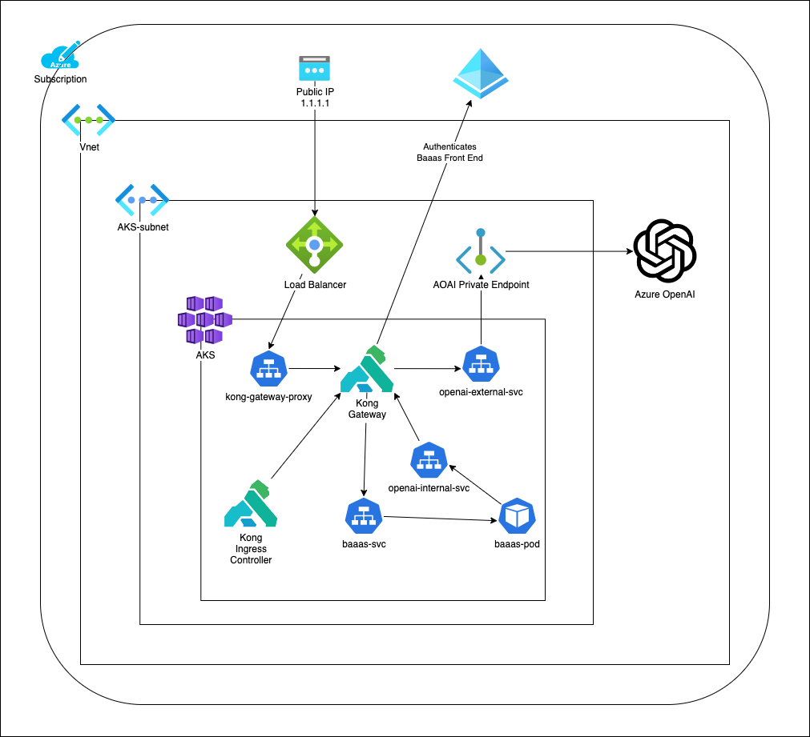

# Intent

This repo is designed to walk through the Azure OpenAI demo at Kong's API Summit.

## Architecture

This deployment uses the ["Bad Advice As a Service"](https://github.com/lastcoolnameleft/bad-advice-generator) repo docker image as an "uninteresting" webapp which provides a simple UI interface for Azure OpenAI.  Both the webapp and Azure OpenAI are fronted by Kong Ingress Controller.

This meets the following requirements for this demo:
- Deploy a simple webapp which uses OpenAI in Azure Kubernetes Service
- Demonstrate using Kong to secure both the webapp and OpenAI
- Prevent Azure OpenAI from being available from the public internet ([use Private Endpoints](https://learn.microsoft.com/en-us/azure/ai-services/cognitive-services-virtual-networks?context=%2Fazure%2Fai-services%2Fopenai%2Fcontext%2Fcontext&tabs=portal#use-private-endpoints))

Security Goals:
- Protect webapp with OIDC
- Rate-limit OpenAI requests
- Restrict OpenAI endpoint to only internal subnet



## Limitations

For simplicity sake, there are additional best practices which this repo does not follow, but are recommended:
- [Use Managed Identity instead of Key](https://learn.microsoft.com/en-us/azure/ai-services/openai/how-to/managed-identity)
- [Store customer managed keys in Azure Key Vault](https://learn.microsoft.com/en-us/azure/ai-services/openai/encrypt-data-at-rest#customer-managed-keys-with-azure-key-vault)

## Prereqs

* Azure Subscription
* Azure CLI

## Create resources

[Azure Docs Reference](
https://learn.microsoft.com/en-us/azure/ai-services/openai/how-to/create-resource?pivots=cli)
```
BAAAS_IMAGE=docker.io/lastcoolnameleft/bad-advice-generator
RG=api-summit
LOCATION=eastus
AKS_NAME=api-summit-aks
AOAI_NAME=api-summit-aoai

az group create -n $RG -l $LOCATION
az aks create -g $RG -n $AKS_NAME --enable-oidc-issuer
az aks get-credentials -g $RG -n $AKS_NAME

az cognitiveservices account create \
--name $AOAI_NAME \
--resource-group $RG \
--location $LOCATION \
--kind OpenAI \
--sku s0
```

## Deploy Model

```
az cognitiveservices account deployment create \
--name $AOAI_NAME \
--resource-group $RG  \
--deployment-name text-davinci-003 \
--model-name text-davinci-003 \
--model-version "1"  \
--model-format OpenAI \
--sku-capacity "1" \
--sku-name "Standard"
```

## Turn off all external network access to AOAI

[Azure Docs Reference](https://learn.microsoft.com/en-us/azure/ai-services/cognitive-services-virtual-networks?tabs=portal)

1. Go into portal and [enable custom domain](https://learn.microsoft.com/en-us/azure/ai-services/cognitive-services-custom-subdomains#how-does-this-impact-existing-resources)
```
az cognitiveservices account show \
    --resource-group $RG --name $AOAI_NAME \
    --query properties.networkAcls.defaultAction
AOAI_RESOURCE_ID=$(az cognitiveservices account show --resource-group $RG --name $AOAI_NAME --query id --output tsv)
echo $AOAI_RESOURCE_ID
az resource update \
    --ids $AOAI_RESOURCE_ID \
    --set properties.networkAcls="{'defaultAction':'Deny'}"
```

## Enable VNet access
```
AKS_NODE_RG=$(az aks show -g $RG -n $AKS_NAME --query nodeResourceGroup -o tsv)
# Assuming the first vnet in the AKS_NODE_RG is the one we want
AKS_VNET_NAME=$(az network vnet list -g $AKS_NODE_RG --query '[0].name' -o tsv)
AKS_SUBNET_NAME=$(az network vnet subnet list -g $AKS_NODE_RG --vnet-name $AKS_VNET_NAME --query '[0].name' -o tsv)
AKS_SUBNET_ID=$(az network vnet subnet list -g $AKS_NODE_RG --vnet-name $AKS_VNET_NAME --query '[0].id' -o tsv)

echo $AKS_NODE_RG 
echo $AKS_VNET_NAME
echo $AKS_SUBNET_NAME
echo $AKS_SUBNET_ID

# Should return an empty list because we haven't added anything yet
az cognitiveservices account network-rule list \
    --resource-group $RG --name $AOAI_NAME \
    --query virtualNetworkRules

az network vnet subnet update -g $AKS_NODE_RG --name $AKS_SUBNET_NAME \
--vnet-name $AKS_VNET_NAME --service-endpoints "Microsoft.CognitiveServices"

# Use the captured subnet identifier as an argument to the network rule addition
az cognitiveservices account network-rule add \
    --resource-group $RG --name $AOAI_NAME \
    --subnet $AKS_SUBNET_ID

# Should now return a single row 
az cognitiveservices account network-rule list \
    --resource-group $RG --name $AOAI_NAME \
    --query virtualNetworkRules
```

## Create K8s Deployment

```
AOAI_ENDPOINT=$(az cognitiveservices account show -n $AOAI_NAME -g $RG --query 'properties.endpoint' -o tsv)
AOAI_KEY=$(az cognitiveservices account keys list -n $AOAI_NAME -g $RG --query 'key1' -o tsv)
echo $AOAI_ENDPOINT
echo $AOAI_KEY

kubectl create secret generic aoai --from-literal=OPENAI_API_KEY=$AOAI_KEY --from-literal=OPENAI_ENDPOINT=https://openai-internal-service
kubectl apply -f k8s/deployment.yaml
```

## Deploy Kong

https://docs.konghq.com/kubernetes-ingress-controller/latest/
```

kubectl create namespace kong
helm repo add kong https://charts.konghq.com
helm repo update

# From the Kong Portal, download the certificate and key
kubectl create secret tls konnect-client-tls -n kong --cert=./tls.crt --key=./tls.key
# From the Kong Portal, download the values.yaml file
helm install kong kong/ingress -n kong --values ./values.yaml
```

## Deploy Cert Manager (Create SSL cert for webapp)

```
# https://docs.konghq.com/kubernetes-ingress-controller/latest/guides/cert-manager/
# https://cert-manager.io/docs/installation/

kubectl apply -f https://github.com/cert-manager/cert-manager/releases/download/v1.12.4/cert-manager.yaml
```

## Protect Webapp with Kong + OIDC

Inspired by [Kong's OIDC documentation](https://docs.konghq.com/kubernetes-ingress-controller/2.11.x/guides/using-oidc-plugin/) and [Kong's OIDC AAD documentation](https://docs.konghq.com/gateway/latest/kong-plugins/authentication/oidc/azure-ad/)

[Register an App in Azure Active Directory](https://learn.microsoft.com/en-us/azure/active-directory/develop/quickstart-register-app)

Notable values to copy from App Registration into k8s definitions
- Issuer: e.g. https://login.microsoftonline.com/16b3c013-d300-468d-ac64-7eda0820b6d3
- Application (Client) ID: e.g. 1efaa100-501f-4055-a6a7-490b40b832df
- Redirect URL: e.g. https://20.127.181.57.nip.io/
- Client Secret: e.g. XXXXX~YYYY_ZZZZ0000

```
# update k8s/kong-plugin-oidc.yaml with the specific OIDC values
kubectl apply -f k8s/kong-plugin-oidc.yaml

# update k8s/ingress-web.yaml with your public IP and email address (it will fail with example.com email)
kubectl apply -f k8s/ingress-web.yaml
```

## Protect Azure OpenAI with Kong + Rate Limiting

Inspired by [Kong's rate limiting documentation](https://docs.konghq.com/hub/kong-inc/rate-limiting/) and [examples](https://docs.konghq.com/hub/kong-inc/rate-limiting/how-to/basic-example/)

```
# update k8s/ingress-openai.yaml with Azure OpenAI endpoint
kubectl apply -f k8s/kong-plugin-rate-limit.yaml
kubectl apply -f k8s/ingress-openai.yaml
```